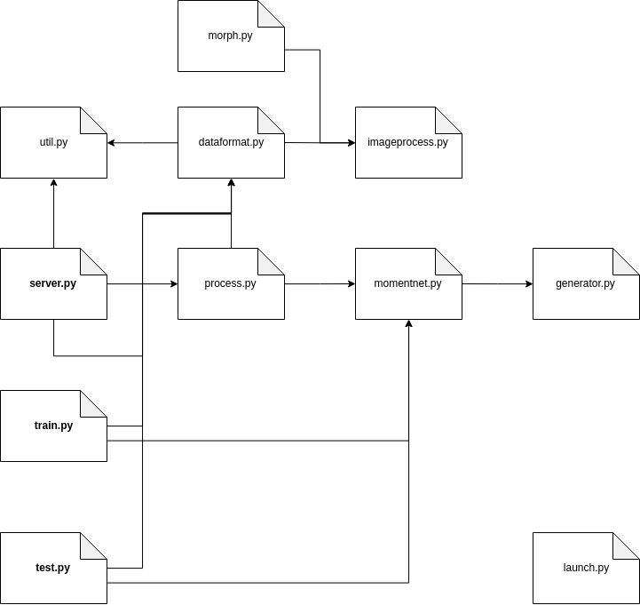

# Howtox 

Or simply, how to x, jump to the topic of your concern.

* [x = read the project](#read-the-project)
* [x = deploy](#deploy)
* [x = training with new data](#training-with-new-data)
* [x = update templates](#update-templates)
* [x = update web model](#update-web-model)
* [x = train on TPUs](#train-on-tpus)
* [x = generate morph targets for web](#generate_morph_targets_for_web)

## Read the project

### Script dependency graph



* `server.py` `train.py` `test.py` are the execution points for users.
* `process.py` handles threading.
* `momentnet.py` is the neural network model core written in TensorFlow.
* `generator.py` is a neural network sub-module for altering data for training.
* `dataformat.py` manages data formatting, which in itself invokes 
* `imageprocess.py` to convert image pixel coordinate into contour coordinate.
* `util.py` contains utility functions.

### Sub-directories

*  `artifacts` keeps non-persisting generated files; e.x., server certificates.
```
├── artifacts
│   ├── domain.crt
│   ├── domain.key
```
* `data` keeps formatted datasets for training
```
├── data
│   ├── 1.0
│       ├── dataset_1
│       │   └── 2018-09-19
│       ├── dataset_2
│       │   ├── 2018-08-31
│       │   ├── 2018-09-01
│       │   ├── 2018-09-03
│       │   ├── 2018-09-04
│       │   └── 2018-09-05
```
* `tasks` keeps scripts for miscellaneous tasks
```
├── tasks
│   ├── assets
│   ├── categories
│   ├── gen_format.py
│   ├── interact_plot.py
│   ├── morph.py
│   ├── pascal.py
│   ├── plot.py
│   ├── rename.py
│   ├── tpu
│   ├── vae.py
│   └── weight_sets
```
* `templates` keeps formatted datasets for matching (see project description for details.)
```
├── templates
│   ├── templates_1
│   ├── templates_2
```
* `web` keeps all files related to web version.
```
├── web
│   ├── background.html
│   ├── chinese_zodiac
│   ├── css
│   ├── index.html
│   ├── jquery-3.2.1.min.js
│   ├── model
│   ├── morph_data
│   ├── morph.js
│   ├── one_hand_zodiac
│   ├── opencv.js
│   ├── preprocessing.js
│   ├── record.html
│   ├── shadow.js
│   └── shadow_puppetry
```
* `weight_sets` keeps the network weights.
```
└── weight_sets
    ├── weight_set_1
```

### Web modules

* `preprocessing.js` is an image processing backend from managing camera to extracting contours.
* `shadow.js` transforms from contours to class label, also manages weight downloading.
* `morph.js` handles morphing.

## Deploy

1. Check `artifacts` for the private key and certificate files.
```
├── artifacts
│   ├── domain.crt
│   ├── domain.key
```
2. Edit `server.py`

    `   "certfile": os.path.join(os.path.dirname(__file__), "artifacts", `**`"domain.crt"`**`)`

    `"keyfile": os.path.join(os.path.dirname(__file__), "artifacts", `**`"domain.key"`**`)`

3. Install weights and templates
```
├── weight_sets
│   ├── weight_set
├── templates
│   ├── templates
```

4. Run
```
python3 server.py
```

Now the server should initialize and load the model. You can update the the model, selecting weights and templates at any time from `https://<url>:<port>/index.html`

To make sure that a certain weight set and template set are loaded by default, simply delete others.

## Training with new data

Given a folder of raw PNG images for training, 

1. Copy `categories` from `tasks` to a temporary directory.
2. Distribute each image into a corresponding label folder inside the temporary directory.
    1. Folder names are the labels, with negative implies horizontal flip. (E.g., -5 = a folder of all label 5 examples that comes from left.) 
    2. Folder starts from 1. (0 is left-out on purpose.)
3. Go to `tasks/gen_format.py`, update the following paths

    `hierarchy_path = os.path.join(pwd, `"Path to your temporary directory"`)`
    `target_path = os.path.join(pwd, `"Path to a will-be-generated"`)`

    And run it.

4. Name the dataset, e.g. `dataset_1`. Mark the date of generation, say 2018-09-19. And copy the generated formatted images to

    ```
    ├── data
    │   └── 1.0
    │       └── dataset_1
    │           └── 2018-09-19
    │               ├── 0.1.-1,0,100,100.png
    │               ├── 1.1.-1,0,100,100.png
    ```

    `1.0` is api version.

5. After you have all the data, say `dataset_1` and `dataset_2`. And you want to training a new weight `super_good_weight`. Execute training via

    ```
    python3 train.py --list dataset_1 dataset_2 --iter 1000 --name super_good_weight
    ```

    Go grab some tea, this will take some time.

6. (optional) you can copy this weight set anywhere. **BUT RENAMING THE WEIGHT SET IS NOT ADVICED.** TensorFlow stores paths using this weight set name internally.

## Update templates

Given a folder of raw PNG images to be used as templates, 

1. Follow steps 1. through 3. of [training with new data](#training-with-new-data).
2. Name the template set, e.g. `template_1`. And copy the generated formatted images to
    ```
    ├── templates
    │   ├── templates_1
    │       ├── 0.1.-1,0,100,100.png
    │       ├── 1.1.-1,0,100,100.png
    ```

3. (optional) you can copy this template set anywhere. Unlike the weight sets, template sets can be renamed.

## Update web model

1. [Deploy the server.](#deploy)

2. When you select a new choice of weight set or template set from `https://<url>:<port>/index.html`, the server will automatically pack everything for web. Check the console for.
    ```
    writing to  model/model_2.json
    writing to  model/model_3.json
    writing to  model/model_4.json
    writing to  model/model_5.json
    writing to  model/model.json
    ```

3. The packed model (weights and templates) can be located here:
    ```
    ├── web
    │   ├── model
    ```

## Train on TPUs

The branch had not been updated for some times. It might not work anymore.


## Generate morph targets for web

1. Go to `morph.py` and edit line `save_target_for_web_download(os.path.join(os.path.dirname(os.path.realpath(__file__)), "web"), raw_target_dir, size, True)` with `raw_tar_get_dir` points to a folder containing outline images for morphing. (Ex., `data/morph_targets`)
2. Run `python3 morpy.py`, this commands will generate necessary data for morphing on web at 
    ```
    ├── web
    │   ├── morph_data
    ```
3. Copy the entire directory to the server.